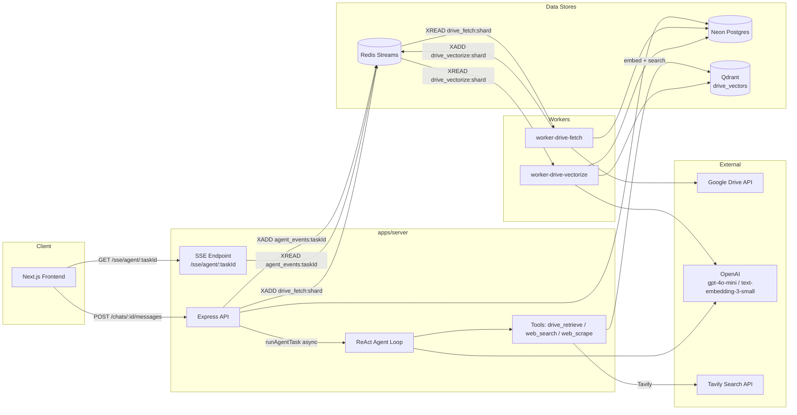
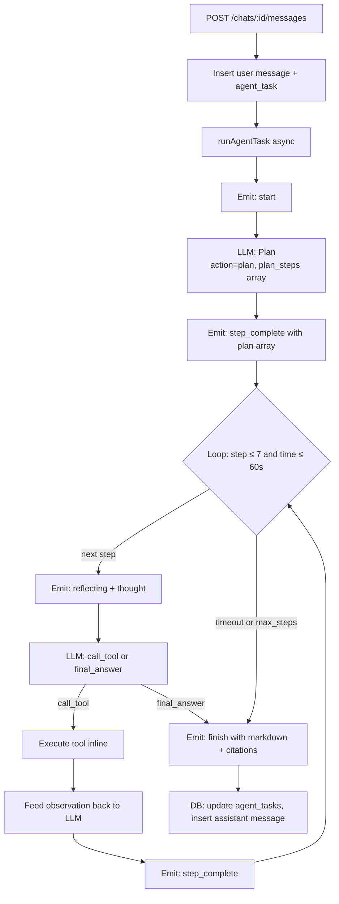
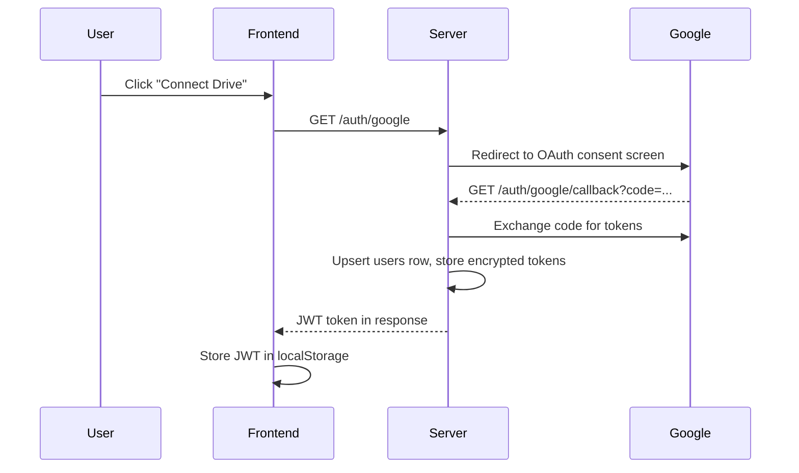
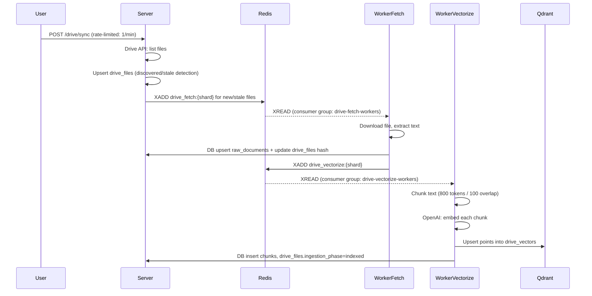
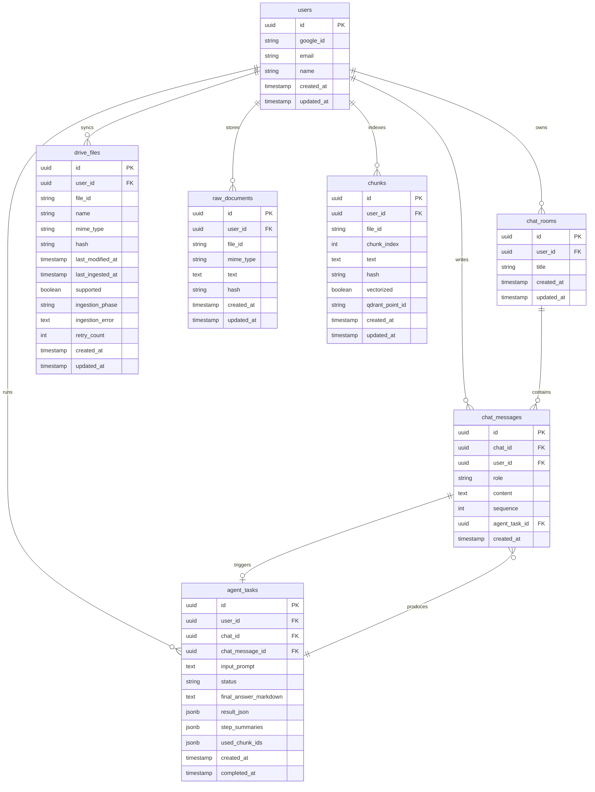

# Biscuit

**Biscuit** is a chat-based AI backend that lets users talk to a ReAct-style agent that knows their Google Drive. Users connect their Drive, index their documents, and then query them via Retrieval-Augmented Generation — the agent handles planning, tool selection, observation, and final answer generation in a streaming loop backed by Redis Streams and served over SSE.


---

## Table of Contents

1. [High-Level Architecture](#high-level-architecture)
2. [Tech Stack](#tech-stack)
3. [Project Structure](#project-structure)
4. [Agent Architecture (Deep Dive)](#agent-architecture-deep-dive)
5. [Tools](#tools)
6. [Google Drive Integration](#google-drive-integration)
7. [Vector Database & Embeddings](#vector-database--embeddings)
8. [Real-Time Streaming (SSE)](#real-time-streaming-sse)
9. [Background Job System](#background-job-system)
10. [Authentication](#authentication)
11. [Database Schema](#database-schema)
12. [API Reference](#api-reference)
13. [Frontend Architecture](#frontend-architecture)
14. [Getting Started](#getting-started)
15. [Environment Variables](#environment-variables)
16. [Available Scripts](#available-scripts)

---

## High-Level Architecture



### End-to-End Data Flows

**Chat message → streamed answer:**
```
User input
  → POST /chats/:chatId/messages
  → DB: insert chat_messages (role=user) + agent_tasks (status=pending)
  → runAgentTask() [async, not awaited]
  → ReAct loop: Plan → Execute tools → Observe → Finalize
      → XADD agent_events:{taskId}  (per event)
  → GET /sse/agent/:taskId
      → XREAD agent_events:{taskId}
      → SSE push to browser
  → Frontend renders plan checklist + thought log + final answer + citations
```

**Drive sync → indexed chunks:**
```
POST /drive/sync
  → Google Drive API: list files
  → DB: upsert drive_files
  → XADD drive_fetch:{shard}
  → worker-drive-fetch:
      → Download file → extract text
      → DB: upsert raw_documents
      → XADD drive_vectorize:{shard}
  → worker-drive-vectorize:
      → Chunk text (800 tokens / 100 overlap)
      → OpenAI: embed each chunk (text-embedding-3-small)
      → Qdrant: upsert points into drive_vectors
      → DB: insert chunks, update drive_files.ingestion_phase=indexed
  → drive_retrieve tool: embed query → Qdrant search → return citations + snippets
```

---

## Tech Stack

| Technology | Role |
|---|---|
| **Next.js 15 (App Router)** | Frontend — SSR, chat UI, Drive management |
| **Express.js** | API server (`apps/server`) |
| **Turborepo + pnpm** | Monorepo build orchestration |
| **Neon (serverless Postgres)** | Primary database via Drizzle ORM |
| **Drizzle ORM** | Type-safe SQL queries and migrations |
| **Redis (Upstash / self-hosted)** | Stream-based event bus + job queues |
| **Qdrant Cloud** | Vector similarity search (`drive_vectors` collection) |
| **OpenAI gpt-4o-mini** | Agent reasoning, planning, final answer generation |
| **OpenAI text-embedding-3-small** | Chunk + query embeddings |
| **Tavily** | Web search in agent tool loop |
| **Google Drive API + OAuth2** | User Drive access and file ingestion |
| **KEDA** | Autoscaling workers based on Redis stream lag |
| **k3s** | Lightweight Kubernetes for deployment |
| **GitHub Actions** | CI/CD: build → push Docker images → deploy via kubectl |

---

## Project Structure

```
biscuit/
├── apps/
│   ├── server/                    # Express API + ReAct agent
│   │   └── src/
│   │       ├── agent/             # runAgentTask.ts, loop.ts (ReAct loop)
│   │       ├── tools/             # driveRetrieve.ts, web_search.ts, web_scrape.ts
│   │       ├── drive/             # Google Drive API client + route handlers
│   │       ├── auth/              # Google OAuth handlers
│   │       ├── chat/              # Chat room and message logic
│   │       ├── llm/               # openai.ts (callPlannerLLM, getEmbedding)
│   │       └── routes/            # Express router bindings
│   ├── web/                       # Next.js 15 frontend
│   │   └── src/
│   │       ├── app/chat/[id]/     # Chat room page (SSE consumer, AgentThoughtLoader)
│   │       ├── components/chat/   # MessageList, AgentThoughtLoader, CitationModal
│   │       └── components/drive/  # DriveSyncModal, IndexedDocsModal
│   ├── worker-drive-fetch/        # Fetch & text-extract worker
│   └── worker-drive-vectorize/    # Chunk, embed, upsert Qdrant worker
│
├── packages/
│   ├── db/                        # Drizzle schema, migrations, typed db client
│   ├── redis/                     # XADD/XREAD helpers, consumer group helpers
│   ├── qdrant/                    # ensureDriveVectorsCollection, searchDriveVectors
│   └── zod-schemas/               # All shared Zod schemas and inferred types
│
├── k8s/                           # Kubernetes manifests (server, workers, KEDA)
└── .github/workflows/deploy.yml   # CI/CD pipeline
```

---

## Agent Architecture (Deep Dive)

The agent is a **ReAct loop** implemented in `apps/server/src/agent/loop.ts`, orchestrated by `runAgentTask.ts`. It runs entirely in-process on `apps/server` — no separate orchestration service.

### Loop Overview



### Planning

The first LLM call must return `action: "plan"` with a `plan_steps` string array. The agent emits a `step_complete` event carrying the full `plan` array so the frontend can render all planned steps at once before execution begins.

### Execution Loop

Each iteration:
1. Emits `reflecting` with `thought_for_next_step` — what the agent intends to do *next* (not the current step).
2. Calls LLM → expects `action: "call_tool"` with `tool`, `tool_query`.
3. Executes tool inline (no subprocess, no queue).
4. Injects `Tool {toolName} Execution Result:\n{observation}` back into the trajectory.
5. Emits `step_complete` with `observationSummary`.

### JSON Output Contract

The LLM is constrained to exactly three valid JSON shapes — no markdown wrapping, no prose:

```jsonc
// OPTION 1: plan (step 1 only)
{ "action": "plan", "plan_steps": ["...", "..."], "thought_for_next_step": "..." }

// OPTION 2: tool call
{ "action": "call_tool", "tool": "drive_retrieve|web_search|web_scrape", "tool_query": "...", "thought_for_next_step": "..." }

// OPTION 3: finish
{ "action": "final_answer", "final_answer_markdown": "...", "thought": "..." }
```

Invalid JSON triggers a re-prompt before incrementing the step counter.

### Constraints

| Constraint | Value |
|---|---|
| Max steps | 7 |
| Max wall-clock time | 120 seconds |
| `runAgentTask` | Async, not awaited by HTTP handler |
| In-process concurrency cap | Configurable (`MAX_CONCURRENT_TASKS`) |

---

## Tools

All tools are implemented inline in `apps/server/src/tools/`. No subprocess or separate worker is used.

### `drive_retrieve`

| Field | Detail |
|---|---|
| **File** | `src/tools/driveRetrieve.ts` |
| **Input schema** | `DriveRetrieveInputSchema`: `{ query: string, userId: string, topK?: number }` |
| **Steps** | Embed query → Qdrant search on `drive_vectors` filtered by `user_id` → fetch `chunks` rows from Postgres → group by `file_id` (top 2 chunks/file) → cap at 5 files |
| **Output** | `{ formattedSnippet: string, citations: DriveCitation[] }` |
| **Score cutoff** | Hits below 0.2 cosine similarity are dropped |

### `web_search`

| Field | Detail |
|---|---|
| **File** | `src/tools/web_search.ts` |
| **Input schema** | `WebSearchInputSchema`: `{ query: string, topK?: number }` |
| **Steps** | Call Tavily Search API → format results as `WebCitation[]` |
| **When used** | After `drive_retrieve` if Drive results are insufficient, or for queries requiring current/general knowledge |

### `web_scrape`

| Field | Detail |
|---|---|
| **File** | `src/tools/web_scrape.ts` |
| **Input** | `{ url: string }` — must be a valid HTTP/HTTPS URL |
| **Steps** | Extract URL from query → fetch and extract main text content → truncate to 2000 chars |
| **When used** | After `web_search` to read full page content from a specific result URL |

---

## Google Drive Integration

### OAuth Flow



### Sync Pipeline



### Ingestion Phases

| Phase | Meaning |
|---|---|
| `discovered` | File found in Drive, waiting for fetch job |
| `fetching` | `worker-drive-fetch` is downloading |
| `chunk_pending` | Raw text stored, waiting for vectorize job |
| `vectorizing` | `worker-drive-vectorize` is embedding |
| `indexed` | Fully embedded and searchable in Qdrant |
| `failed` | Retry count exceeded (max 2 retries) |

---

## Vector Database & Embeddings

**Collection:** `drive_vectors` (Qdrant Cloud)
**Distance metric:** Cosine similarity
**Embedding model:** `text-embedding-3-small` (1536 dimensions)

### Point Payload

Each Qdrant point corresponds to one `chunks` row and carries:

```json
{
  "user_id":    "uuid",
  "file_id":    "drive-file-id",
  "file_name":  "Report.pdf",
  "chunk_index": 3,
  "mime_type":  "application/pdf",
  "hash":       "sha256..."
}
```

### Chunking Strategy

| Parameter | Value |
|---|---|
| Chunk size | ~800 tokens |
| Overlap | ~100 tokens |
| ID | `chunks.id` (UUID, also used as Qdrant point ID) |

### Per-User Isolation

All Qdrant searches apply a `must` filter on `user_id` — users can only retrieve their own documents.

### Retrieval Post-Processing

After search:
1. Filter hits below score threshold (0.2).
2. Fetch `chunks` DB rows for all hits.
3. Group by `file_id`, take top 2 chunks per file.
4. Cap at 5 unique files returned to the agent.

---

## Real-Time Streaming (SSE)

**Endpoint:** `GET /sse/agent/:taskId?since={lastEventId}`

The agent emits all intermediate events — plan, thoughts, tool calls, observations, final answer — to the Redis stream `agent_events:{taskId}` via `XADD`. The SSE endpoint reads from this stream with `XREAD` and pushes each event as an SSE `data:` frame with the Redis stream ID as the SSE `id:` field.

```
agent loop --XADD--> agent_events:{taskId} --XREAD--> /sse/agent/:taskId --SSE--> browser
```

### Event Types

| Event Type | When emitted | Key fields |
|---|---|---|
| `start` | Task begins | `taskId` |
| `plan` | Planning complete | `plan: string[]`, `thought_for_next_step` |
| `step_executing` | Tool about to be called | `tool`, `thought` |
| `reflecting` | LLM is thinking | `thought` |
| `step_complete` | Tool result observed | `observationSummary`, `progress` |
| `finish` | Final answer ready | `finalAnswerMarkdown`, `citations[]` |

### Frontend Consumption

The frontend in `apps/web/src/app/chat/[id]/page.tsx`:
1. Subscribes to `GET /sse/agent/:taskId` on task creation.
2. On `plan` event: populates `agentPlan: string[]`, renders plan checklist.
3. On `reflecting`/`step_executing`: appends to `agentThoughts[]` (deduplicated).
4. Updates `currentStepIndex` → strikes through completed plan steps.
5. On `finish`: renders final answer markdown and citation chips.

### SSE Nginx Requirements

nginx must be configured with `proxy_buffering off` and `proxy_read_timeout 300s` to prevent buffering that would break the streaming experience.

---

## Background Job System

Two independent worker apps process Drive ingestion jobs via Redis Streams consumer groups.

| Stream Key | Consumer Group | Worker |
|---|---|---|
| `drive_fetch:{shard}` | `drive-fetch-workers` | `apps/worker-drive-fetch` |
| `drive_vectorize:{shard}` | `drive-vectorize-workers` | `apps/worker-drive-vectorize` |

Workers are scaled to zero when queues are empty (KEDA `minReplicaCount: 0`) and scale up to 5 replicas when pending entry count exceeds 5.

`agent_events:{taskId}` is **not** a consumer group stream — every SSE client reads from its own position independently.

---

## Authentication

- **OAuth flow:** `GET /auth/google` → `GET /auth/google/callback`.
- Google tokens are stored encrypted per-user in Postgres.
- On callback: upsert `users` row, issue a signed **JWT**.
- All authenticated API endpoints verify the JWT via `Authorization: Bearer <token>`.
- Token is stored in `localStorage` on the frontend (`biscuit_auth_token`) and injected by `fetchWithAuth` in `src/lib/apiClient.ts`.
- 401/403 responses automatically clear the token and redirect to `/login`.

---

## Database Schema



---

## API Reference

### Auth

| Method | Path | Description |
|---|---|---|
| `GET` | `/auth/google` | Redirect to Google OAuth consent screen |
| `GET` | `/auth/google/callback` | Exchange code, upsert user, return JWT |

### Chat

| Method | Path | Body / Params | Description |
|---|---|---|---|
| `POST` | `/chats` | `{}` | Create a new chat room |
| `GET` | `/chats/:chatId` | — | Fetch chat + last N messages |
| `PATCH` | `/chats/:chatId` | `{ title }` | Update chat title |
| `POST` | `/chats/:chatId/messages` | `{ content }` | Send message, start agent task |

### Agent / Tasks

| Method | Path | Description |
|---|---|---|
| `GET` | `/tasks/:taskId` | Task status, final answer, step summaries |
| `GET` | `/sse/agent/:taskId?since=` | SSE stream of `AgentEvent`s |
| `GET` | `/tasks/:taskId/events?since=` | Polling endpoint, returns `AgentProgressResponse` |

### Drive

| Method | Path | Description |
|---|---|---|
| `POST` | `/drive/sync` | List Drive files, upsert metadata, enqueue fetch jobs |
| `GET` | `/drive/progress` | Per-file ingestion progress + totals |
| `POST` | `/drive/files/:fileId/retry` | Retry a failed file (fetch or vectorize phase) |
| `GET` | `/drive/chunk/:chunkId` | Fetch chunk + neighbors + file metadata |

---

## Frontend Architecture

**Framework:** Next.js 15 (App Router), all client components.

| Path | Purpose |
|---|---|
| `app/page.tsx` | Landing / root redirect |
| `app/login/page.tsx` | Google OAuth entry point |
| `app/chat/page.tsx` | New chat creation, redirects to `chat/[id]` |
| `app/chat/[id]/page.tsx` | Chat room: message list, SSE consumer, `AgentThoughtLoader` |
| `app/chat/layout.tsx` | Sidebar + nav shell |
| `components/chat/AgentThoughtLoader.tsx` | Real-time plan checklist + scrolling thought log |
| `components/chat/MessageList.tsx` | Renders user and assistant messages + citation chips |
| `components/drive/DriveSyncModal.tsx` | Trigger sync, display progress |
| `components/drive/IndexedDocsModal.tsx` | Browse indexed Drive files |
| `components/auth/AuthContext.tsx` | JWT auth state, `/me` fetch on mount |
| `lib/apiClient.ts` | `fetchWithAuth` — injects `Authorization` header, handles 401 redirect |

### State Management (Chat Page)

```ts
const [messages, setMessages]           // Rendered chat messages
const [agentPlan, setAgentPlan]         // string[] from plan event
const [agentThoughts, setAgentThoughts] // { id, text }[] — append-only log
const [currentStepIndex, setCurrentStepIndex] // Drives checklist strikethrough
const [isGenerating, setIsGenerating]   // Shows AgentThoughtLoader
```

---

## Getting Started

### Prerequisites

- Node.js ≥ 22
- pnpm ≥ 9
- A Neon Postgres database
- Redis (Upstash or self-hosted)
- Qdrant Cloud account
- OpenAI API key
- Google OAuth application credentials
- Tavily API key (for web search)

### Installation

```bash
git clone https://github.com/iBreakProd/biscuit.git
cd biscuit
pnpm install
```

### Database Setup

```bash
pnpm --filter @repo/db db:migrate
```

### Development

```bash
# Run all apps concurrently
pnpm dev

# Or individually
pnpm --filter server dev
pnpm --filter web dev
pnpm --filter worker-drive-fetch dev
pnpm --filter worker-drive-vectorize dev
```

### Production Build

```bash
pnpm build
```

---

## Environment Variables

### `apps/server`

| Variable | Description |
|---|---|
| `DATABASE_URL` | Neon Postgres connection string |
| `REDIS_URL` | Redis connection string |
| `QDRANT_URL` | Qdrant Cloud cluster URL |
| `QDRANT_API_KEY` | Qdrant API key |
| `OPENAI_API_KEY` | OpenAI API key |
| `TAVILY_API_KEY` | Tavily web search API key |
| `GOOGLE_CLIENT_ID` | Google OAuth client ID |
| `GOOGLE_CLIENT_SECRET` | Google OAuth client secret |
| `GOOGLE_REDIRECT_URI` | OAuth callback URL |
| `JWT_SECRET` | Secret for signing JWTs |
| `FRONTEND_URL` | Frontend origin (CORS) |

### `apps/worker-drive-fetch` + `apps/worker-drive-vectorize`

| Variable | Description |
|---|---|
| `DATABASE_URL` | Neon Postgres connection string |
| `REDIS_URL` | Redis connection string |
| `QDRANT_URL` | Qdrant Cloud cluster URL *(vectorize only)* |
| `QDRANT_API_KEY` | Qdrant API key *(vectorize only)* |
| `OPENAI_API_KEY` | OpenAI API key *(vectorize only)* |
| `GOOGLE_CLIENT_ID` | Google OAuth client ID *(fetch only)* |
| `GOOGLE_CLIENT_SECRET` | Google OAuth client secret *(fetch only)* |

### `apps/web`

| Variable | Description |
|---|---|
| `NEXT_PUBLIC_API_URL` | Base URL of the deployed API server (e.g. `https://apibiscuit.hrsht.me`) |

---

## Available Scripts

| Script | Command | Description |
|---|---|---|
| `dev` | `pnpm dev` | Run all apps in watch mode |
| `build` | `pnpm build` | Compile all packages and apps |
| `migrate` | `pnpm --filter @repo/db db:migrate` | Run Drizzle migrations against Neon |
| `typecheck` | `pnpm tsc --noEmit` | Type-check all packages |
| `test` | `bash scripts/test.sh` | Integration tests across all phases |
